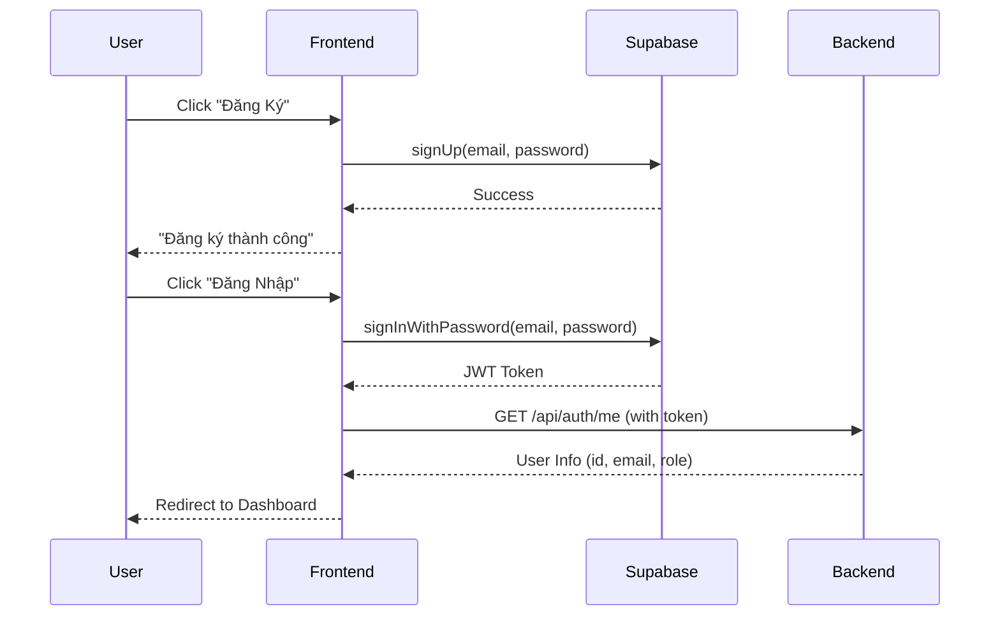

# ✅ Authentication Refactoring Complete

## 🔐 What Changed

The authentication system has been completely refactored to use **Supabase Auth** instead of localStorage-based authentication.

### Before (❌ Old - Insecure)
- Custom localStorage authentication
- Passwords stored in plain text
- No real backend integration
- Client-side only validation

### After (✅ New - Secure)
- Supabase Auth integration
- JWT-based authentication
- Backend user mapping via `/api/auth/me`
- Secure token management

---

## 📁 New Files Created

1. **`lib/auth/supabase-client.ts`**
   - Supabase client singleton
   - Auto-refresh tokens
   - Session persistence

2. **`lib/auth/auth.service.ts`**
   - `signUp()` - Register via Supabase
   - `signIn()` - Login via Supabase
   - `signOut()` - Logout
   - `getUserInfo()` - Fetch user from backend

3. **`lib/api/http-client.ts`**
   - Auto-inject JWT tokens
   - Convenience methods (GET, POST, PUT, DELETE, PATCH)
   - Centralized API error handling

---

## 🔧 Modified Files

1. **`contexts/auth-context.tsx`**
   - Removed localStorage logic
   - Integrated Supabase Auth
   - Added loading state
   - Listen to auth state changes

2. **`components/auth-modal.tsx`**
   - Changed from username → **email** field
   - Uses Supabase sign up/sign in
   - Better error messages

3. **`components/overview/Navigation.tsx`**
   - Display email instead of username
   - Async logout
   - Redirect after logout

4. **`.env.example`**
   - Added Supabase credentials template

---

## 🚀 Setup Instructions

### 1. Install Dependencies

Dependencies are already installed:
```bash
npm install @supabase/supabase-js
```

### 2. Get Supabase Credentials

1. Go to [https://app.supabase.com](https://app.supabase.com)
2. Create a new project (or use existing)
3. Go to **Settings → API**
4. Copy:
   - `Project URL` → `NEXT_PUBLIC_SUPABASE_URL`
   - `anon/public key` → `NEXT_PUBLIC_SUPABASE_ANON_KEY`

### 3. Create `.env.local`

Create a new file: `/Users/chuong/Desktop/AI/ADAS/FrontEnd/.env.local`

```env
# Supabase Configuration
NEXT_PUBLIC_SUPABASE_URL=https://your-project.supabase.co
NEXT_PUBLIC_SUPABASE_ANON_KEY=your-anon-key-here

# ADAS Backend API
NEXT_PUBLIC_API_URL=https://adas-api.aiotlab.edu.vn
```

> ⚠️ **Important**: Replace `your-project` and `your-anon-key-here` with your actual Supabase credentials!

### 4. Configure Supabase Auth

In your Supabase dashboard:

1. **Authentication → Providers**
   - Enable **Email** provider
   - (Optional) Disable email confirmation for development

2. **Authentication → URL Configuration**
   - Add your frontend URL to **Site URL**
   - Add redirect URLs if needed

### 5. Backend Requirements

Your backend MUST implement:

**Endpoint:** `GET /api/auth/me`

**Headers:**
```
Authorization: Bearer <supabase_jwt_token>
```

**Response:**
```json
{
  "success": true,
  "user": {
    "id": 123,
    "auth_id": "uuid-from-supabase",
    "email": "user@example.com",
    "role": "user"
  }
}
```

The backend should:
1. Verify Supabase JWT using JWKS
2. Extract `sub` (Supabase user ID) from token
3. Map to internal integer user ID
4. Return user info

### 6. Test the System

```bash
# Start dev server
npm run dev

# Open browser
# Try registering a new account
# Try logging in
# Check that user info loads from backend
```

---

## 🔄 Authentication Flow



---

## 📝 Usage Examples

### Login
```typescript
import { useAuth } from '@/contexts/auth-context'

const { login } = useAuth()

const result = await login('user@example.com', 'password123')
if (result.success) {
  // Redirected to dashboard
}
```

### Make Authenticated API Call
```typescript
import { api } from '@/lib/api/http-client'

// Token is automatically attached
const response = await api.get('/api/videos')
const data = await response.json()
```

### Check Auth State
```typescript
import { useAuth } from '@/contexts/auth-context'

const { isAuthenticated, user, loading } = useAuth()

if (loading) return <div>Loading...</div>
if (!isAuthenticated) return <div>Please login</div>

return <div>Welcome {user.email}</div>
```

---

## ⚠️ Breaking Changes

1. **All localStorage users are invalidated**
   - Users must re-register via Supabase
   
2. **Email is now required** (not username)
   - Login requires email + password
   - Registration requires email + password

3. **Backend integration is mandatory**
   - Frontend CANNOT work without backend `/api/auth/me`
   - Backend MUST verify Supabase JWTs

---

## 🛡️ Security Improvements

| Aspect | Before | After |
|--------|--------|-------|
| Password Storage | Plain text in localStorage | Never stored on frontend |
| Authentication | Client-side only | Supabase Auth + Backend JWT verification |
| Token Management | None | Automatic refresh, secure storage |
| XSS Protection | Vulnerable | Tokens managed by Supabase SDK |
| CSRF Protection | None | JWT-based (no cookies) |

---

## 🐛 Troubleshooting

### "Missing Supabase configuration" error
- Create `.env.local` with Supabase credentials
- Restart dev server

### "Cannot fetch user info" error
- Check if backend is running
- Check if `/api/auth/me` endpoint exists
- Verify backend JWT verification is working

### Login successful but no redirect
- Check browser console for errors
- Verify backend returns valid user info

---

## 📚 Next Steps

1. ✅ Set up Supabase credentials in `.env.local`
2. ✅ Test registration flow
3. ✅ Test login flow
4. ✅ Verify backend integration works
5. ⏳ (Optional) Add password reset flow
6. ⏳ (Optional) Add email confirmation
7. ⏳ (Optional) Add social login (Google, Facebook)

---

## 📞 Support

If you encounter issues:
1. Check browser console for errors
2. Check Supabase dashboard logs
3. Check backend API logs
4. Verify environment variables are correct

---

**Refactoring completed:** 2026-01-04
**Version:** 1.0.0
